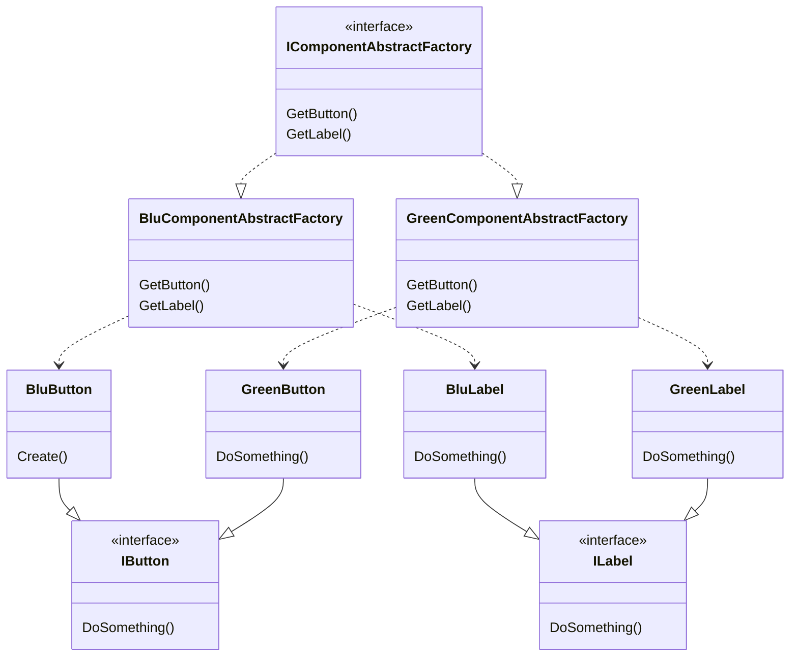

# Advantages
* Particulary useful to create object that have a complex initialization.
* Can be used to create object of the same type.
* Gave control over object creation: dynamic initialization, instance reuse ...

# Notes
* Useful to create Composite trees.
* Can be a Singleton.
* You can use it with Bridge acting as the implementation

# Class Diagram
