# Advantages

- Allows a client application to create object that supports cloning without knowing their implementation.
- Lets you use a set of pre-built objects configured in various ways as prototypes. Instead of instantiating a subclass that matches some configuration, the client can simply look for an appropriate prototype and clone it.

# Notes

- Useful to create Composite trees.
- Can help when you need to save copies of Commands into history.
- Prototype isn’t based on inheritance but requires an initialization of the cloned object. Factory Method is based on inheritance but doesn’t require the initialization.
- It could seems very much like a simple Memento implementation

# Class diagram

